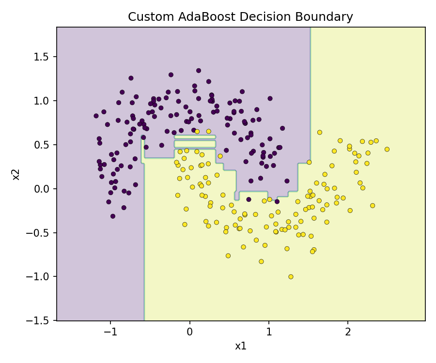

# 🌳 Decision Trees — Demos (Iris & Moons)

Small, focused demos of classical tree methods in scikit‑learn, plus a **from‑scratch AdaBoost (SAMME)** that trains on the two‑moons dataset and saves a decision boundary plot.



## 🚀 Quickstart

```bash
# Create env & install
python -m venv .venv && source .venv/bin/activate   # Windows: .venv\Scripts\activate
pip install -r requirements.txt

# Run any demo
python -m src.demos.iris
python -m src.demos.random_forest_make_moons
python -m src.demos.bagging_classifier
python -m src.demos.random_forest_classifier
python -m src.demos.adaboost     # custom AdaBoost (SAMME)

# Project structure
decision_trees/
├─ src/
│  └─ demos/
│     ├─ iris.py
│     ├─ random_forest_make_moons.py
│     ├─ random_forest_classifier.py
│     ├─ bagging_classifier.py
│     └─ adaboost.py    # custom AdaBoost (SAMME)
├─ utils/
│  └─ __init__.py (e.g., moons_dataset)
├─ figs/                # saved plots
├─ requirements.txt
└─ README.md
